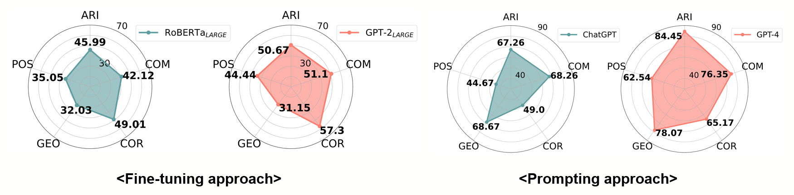
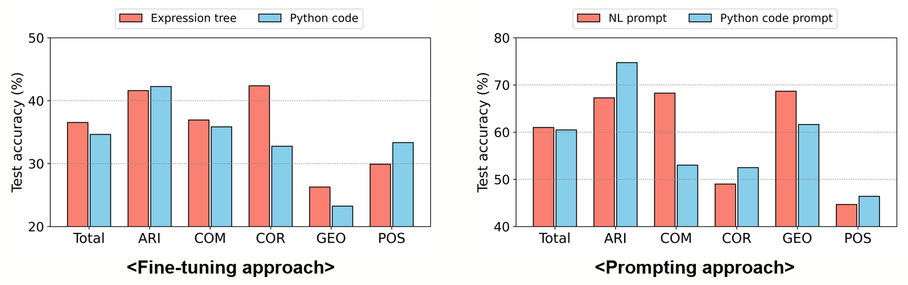

# DMath (Diverse Math Word Problems)

This repository provides DMath (**D**iverse **Math** Word Problems), a collection of 10K high-quality grade school-level math word problems for the paper "[It Ain’t Over: A Multi-aspect Diverse Math Word Problem Dataset]()".

## Details of the dataset
DMath is a multi-aspect diverse MWP dataset, which has the following key features:
* It fully covers problem types across five categories. These include arithmetic calculation (ARI), comparison (COM), correspondence (COR), geometry(GEO), and possibility (POS).
* It consists of about 10,000 problems manually created by 43 human workers covering various lexical usage patterns on natural language narratives and expression trees.
* It supports bilingual input languages, i.e., English and Korean.
* It offers the annotation of expression trees and Python code as intermediate solutions.

In summary, DMath offers a wide range of diversity in problem types, lexical usage patterns, languages, and intermediate solution forms.

## Statistics of the dataset
The table below shows the number of samples per category on DMath.
|       |   ARI |   COM |   COR |   POS |   GEO |  Total |
|-------|------:|------:|------:|------:|------:|-------:|
| Train | 2,476 | 1,338 | 1,656 | 1,417 | 1,056 |  7,943 |
|  Test |   669 |   334 |   402 |   383 |   291 |  2,079 |
| Total | 3,145 | 1,672 | 2,058 | 1,800 | 1,347 | 10,002 |


## Data format
You can see a sample of the data here.
```
"1": {
    "category": "Geometry",
    "question_ko": "테이프를 일직선으로 쭉 붙이려고 한다. 잘라낸 3개의 테이프가 각각 36센티미터(㎝), 42센티미터(㎝), 48센티미터(㎝)이고 같은 부분만큼 겹쳐서 붙이면 총 길이가 97센티미터(㎝)이다. 겹쳐진 부분의 길이는 얼마인지 구하시오.",
    "question_en": "We are trying to stick a tape in a straight line. The three tapes cut are 36 centimeters (cm), 42 centimeters (cm), and 48 centimeters (cm) respectively, and if the same part is overlapped and attached, the total length is 97 centimeters (cm). Find the length of the overlapping part.",
    "answer_ko": "14.5",
    "answer_en": "14.5",
    "solution_abst_ko": "36 42 [OP_ADD] 48 [OP_ADD] 97 [OP_SUB] 3 1 [OP_SUB] [OP_DIV]",
    "solution_abst_en": "36 42 [OP_ADD] 48 [OP_ADD] 97 [OP_SUB] 3 1 [OP_SUB] [OP_DIV]",
    "solution_code_ko": "var_a = 36\nvar_b = 42\nvar_c = var_a + var_b\nvar_d = 48\nvar_e = var_c + var_d\nvar_f = 97\nvar_g = var_e - var_f\nvar_h = 3\nvar_i = 1\nvar_j = var_h - var_i\nvar_k = var_g / var_j\nprint('{:.2f}'.format(round(var_k+1e-10,2)))",
    "solution_code_en": "var_a = 36\nvar_b = 42\nvar_c = var_a + var_b\nvar_d = 48\nvar_e = var_c + var_d\nvar_f = 97\nvar_g = var_e - var_f\nvar_h = 3\nvar_i = 1\nvar_j = var_h - var_i\nvar_k = var_g / var_j\nprint('{:.2f}'.format(round(var_k+1e-10,2)))"
    },
```

One data consists of the following keys:
* `category` : The problem types. It can be `Arithmetic Calculation`, `Comparison`, `Correspondence`, `Possibility`, and `Geometry`.
* `question_ko` : The natural language narratives in Korean.
* `question_en` : The natural language narratives in English.
* `answer_ko` : The answer of the question in Korean.
* `answer_en` : The answer of the question in English. 
* `solution_abst_ko` : The expression tree solution (=abstract solution) of the question in Korean.
* `solution_abst_en` : The expression tree solution (=abstract solution) of the question in English.
* `solution_code_ko` : The Python code solution of the question in Korean.
* `solution_code_en` : The Python code solution of the question in English.

## Experimental Results
The figure below shows the accuracy comparison over various reasoning categories on DMath for RoBERTa ([Liu et al., 2019](https://arxiv.org/pdf/1907.11692.pdf)), GPT-2 ([Radford et al., 2019](https://d4mucfpksywv.cloudfront.net/better-language-models/language-models.pdf)), ChatGPT (`gpt-3.5-turbo`; [OpenAI](https://platform.openai.com/docs/model-index-for-researchers)) and GPT-4 ([OpenAI, 2023](https://arxiv.org/pdf/2303.08774.pdf)). We use the fine-tuning approach for RoBERTa and GPT-2 and use the prompting approach for ChatGPT and GPT-4. The worst problem categories differ across MWP models.




The figure below shows the accuracy comparison results of MWP models on the DMath per expression forms in English. "NL prompt" means the natural language prompt. We set few-shot CoT ([Wei et al., 2022](https://arxiv.org/pdf/2201.11903.pdf)) as NL prompt and PAL ([Gao et al., 2022](https://arxiv.org/pdf/2211.10435.pdf)) as Python code prompt. We use RoBERTa ([Liu et al., 2019](https://arxiv.org/pdf/1907.11692.pdf)) and CodeGPT ([Lu et al., 2021](https://arxiv.org/pdf/2102.04664.pdf)) as the models for expression tree and Python code in the fine-tuning approach. We use GPT-4 ([OpenAI, 2023](https://arxiv.org/pdf/2303.08774.pdf)) as the models for NL prompt and Python code prompt in the prompting approach. A specific prompt type is preferred depending on the problem.




We use `gpt-3.5-turbo-0301` for ChatGPT and `gpt-4-0314` for GPT-4.

